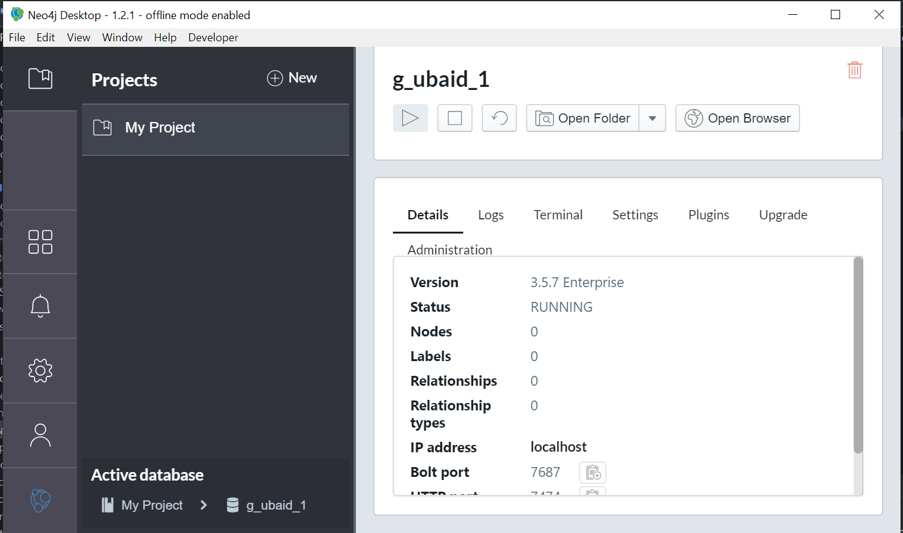
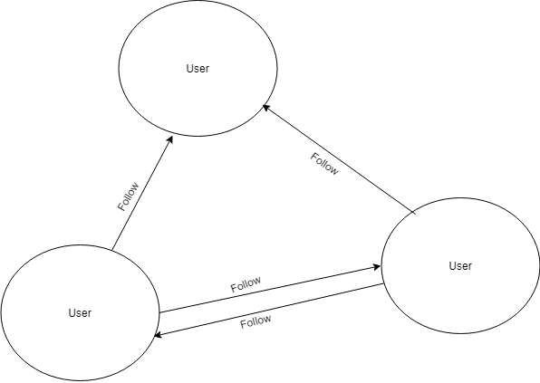
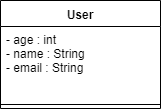

<h2 align="center">Bench Mark Using Neo4j 3X and Bolt API</h2>

<ol>
	<h4>Prerequisite</h4>
	<li>Read out requirements</li>
	<li>Start Neo4j Desktop App</li>
	<li></img></li>
</ol>

<ol>
	<h4>Building Instruction</h4>
	Do the following steps
	<li><strong>git clone 'https://github.com/UbaidurRehman1/Neo4J3xBenchMark.git'</strong></li>
	<li><strong>cd Neo4J3xBenchMark</strong></li>
	<li><strong>mvn clean test compile assembly:single</strong></li>
	<li>cd target</li>
	<li><strong>java -jar  Neo4JTest_1.0.jar</strong> to run the jar</li>
</ol>
<ol>
	<h4>Requirements</h4>
	<li>Neo4J Desktop App and create a local graph</li>
	<li>Java JDK 12 (required)</li>
	<li>Apache MAVEN 3.6.1 (required)</li>
	<li>set JAVA_HOME variable (optional)</li>
	<li>set MAVEN_HOME (optional)</li>
</ol>

<ol>
	<h4>UML Specs [Very First Prototype]</h4>
	<li>
		<h4>Flow Diagram of Graph<h4>
		

			</img>
		

	</li>
	<li>
		<h4>UML diagram of User</h4>
		

			</img>
		

	</li>
</ol>
